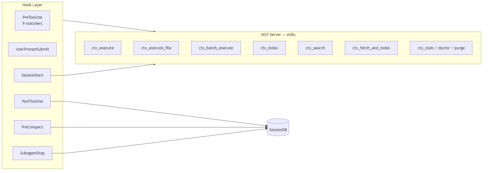
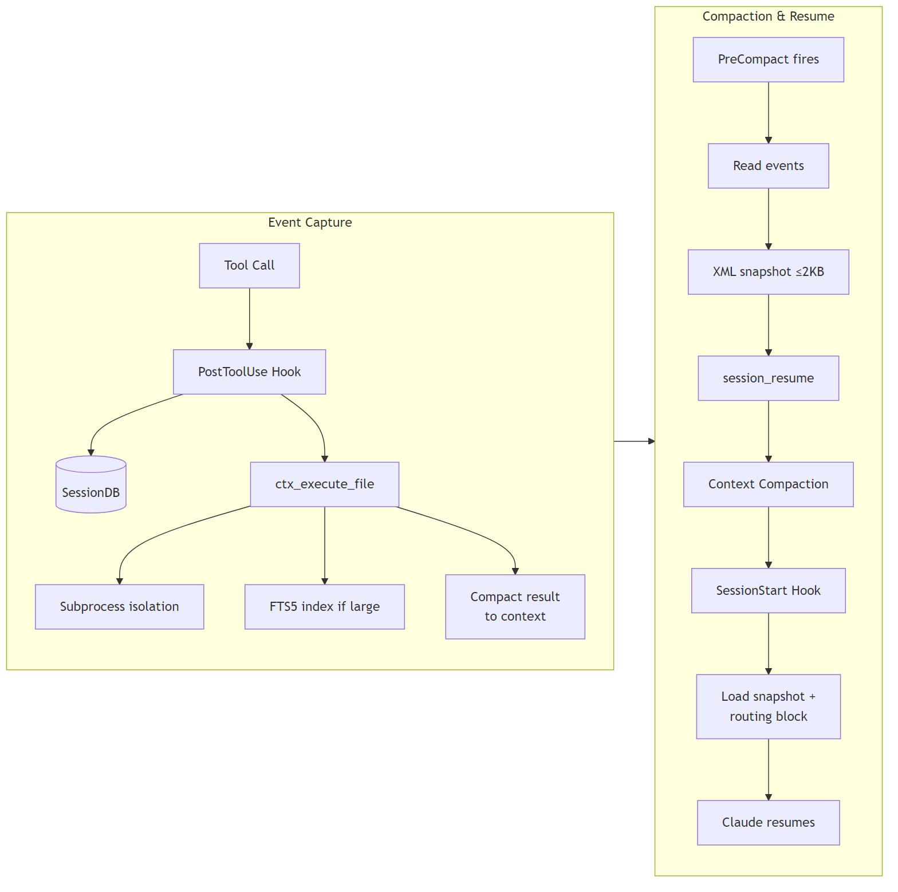
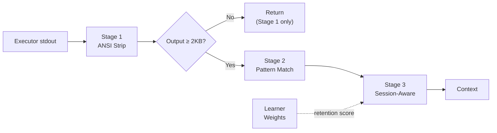
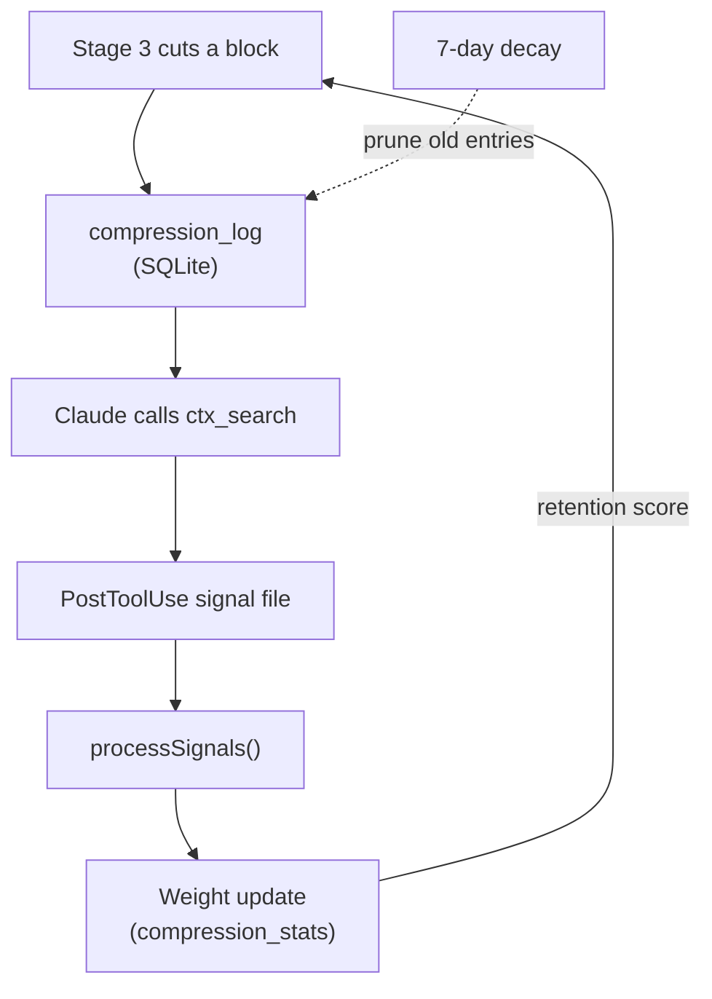
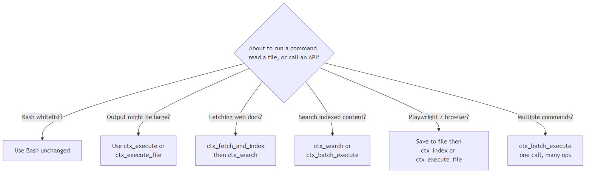
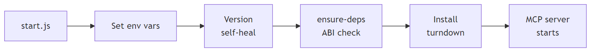
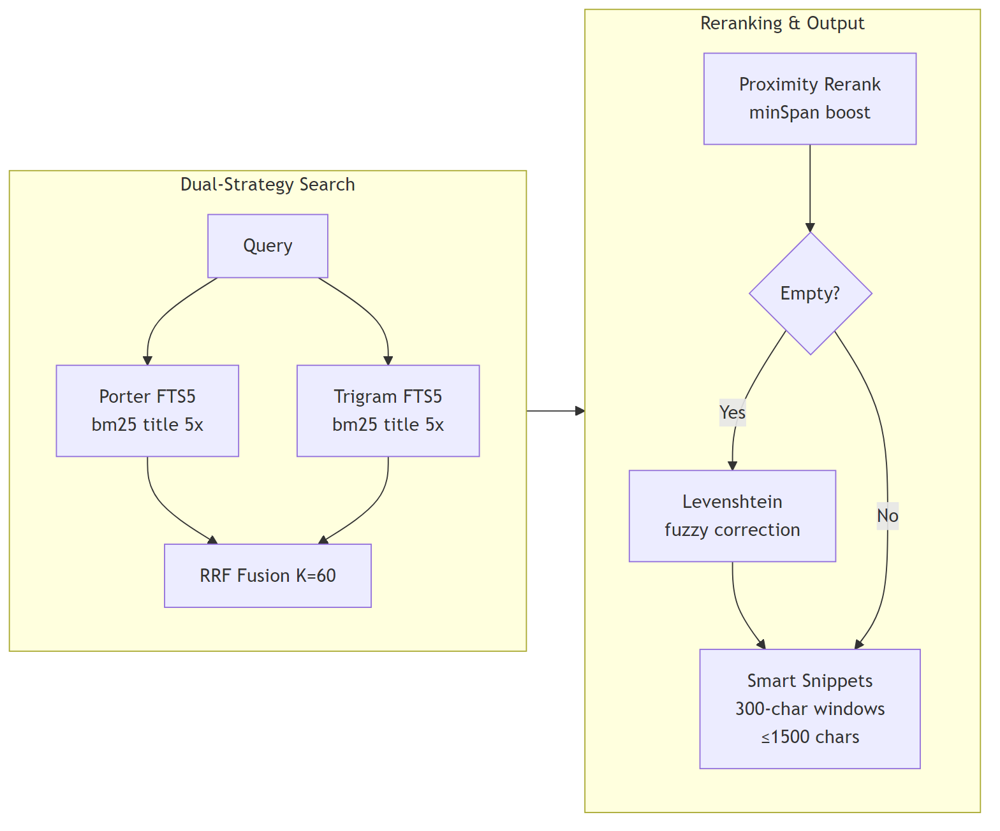

# context-mode — Full Technical Documentation

**Version 1.5.1** | Elastic License 2.0 | April 2026

> Ported from [mksglu/context-mode](https://github.com/mksglu/context-mode) by [@mksglu](https://github.com/mksglu) (Elastic License 2.0). Core algorithms, database schemas, search pipeline, sandbox executor architecture, session event system, and compaction snapshot builder are derived from that project and adapted for the Cowork plugin architecture.

---

## Table of Contents

1. [Overview](#1-overview)
2. [Install](#2-install)
3. [Architecture](#3-architecture)
4. [Tool Steering](#4-tool-steering)
5. [Hook System](#5-hook-system)
6. [Main Skill & Decision Tree](#6-main-skill--decision-tree)
7. [Bootstrapper (start.js)](#7-bootstrapper-startjs)
8. [CLAUDE.md System Directive](#8-claudemd-system-directive)
9. [Permission Rules (.claude/settings.json)](#9-permission-rules-claudesettingsjson)
10. [MCP Server & Tools](#10-mcp-server--tools)
11. [Knowledge Base](#11-knowledge-base)
12. [Sandbox Executor](#12-sandbox-executor)
13. [Session Continuity](#13-session-continuity)
14. [Search Algorithm](#14-search-algorithm)
15. [Compression Pipeline](#15-compression-pipeline)
16. [Self-Learning Compression](#16-self-learning-compression)
17. [Design Decisions](#17-design-decisions)
18. [Configuration Reference](#18-configuration-reference)
19. [Platform Support](#19-platform-support)
20. [Schema Versioning](#20-schema-versioning)
21. [Testing](#21-testing)

---

## 1. Overview

context-mode is a Cowork plugin for Claude Code that reduces context window consumption by up to 98%. It does this through six mechanisms:

- **Hook-Driven Tool Steering**: PreToolUse hooks intercept Bash, Read, Grep, WebFetch, Agent, and Task calls with a mix of policies — deny, block, advisory nudge, or prompt augmentation — steering data-heavy operations toward context-saving alternatives.
- **Sandbox Execution**: Runs code in isolated subprocesses (process isolation, not filesystem sandboxing). For outputs below 5KB, stdout returns directly. Above 5KB with intent, output is auto-indexed and only matching snippets return. Above 100KB, output is always indexed. Supports 11 languages (TypeScript requires global `tsx`).
- **Knowledge Base**: Indexes content into a local SQLite FTS5 database. Retrieves only relevant snippets via BM25 + trigram dual-strategy search.
- **Session Continuity**: Captures session events via hooks, builds priority-tiered snapshots before compaction, and restores session state afterward. A bootstrapper with dependency self-healing ensures the server starts cleanly on every session.
- **Token Compression**: A 3-stage pipeline compresses tool output before it returns to context — deterministic stripping, pattern-based compression (10 tool-specific matchers), and session-aware relevance filtering guided by a self-learning retention model.
- **Main Skill**: The `context-mode` skill provides an in-session decision tree, tool-selection patterns, and anti-patterns so Claude consistently picks the right tool.

### Problem Statement

Long Claude Code sessions in Cowork consume context rapidly. Every file read, web fetch, and shell command dumps raw output into the context window. A single Playwright snapshot can cost 56 KB. Twenty fetched documents can cost hundreds of KB. Over a long task, this bloats context, reduces response quality, and forces premature compaction — causing Claude to lose track of progress.

### Solution

context-mode intercepts data-heavy operations and processes them outside the context window:

```
Without context-mode:           With context-mode:
┌─────────────────────┐        ┌─────────────────────┐
│ Context Window      │        │ Context Window      │
│                     │        │                     │
│ [60KB file content] │        │ [120B search result] │
│ [45KB web page]     │        │ [80B cache hint]     │
│ [30KB cmd output]   │        │ [200B summary]       │
│                     │        │                     │
│ Total: 135KB        │        │ Total: 400B (99.7%) │
└─────────────────────┘        └─────────────────────┘
```

---

## 2. Install

**One command:**

```bash
npx --yes --package=github:scottconverse/context-mode context-mode
```

This clones the plugin to the Cowork plugin cache, registers it, installs native dependencies, and verifies that all 9 MCP tools respond. After installation, start a new session and run `/context-mode:ctx-doctor` to confirm.

**Via Cowork marketplace:**

```
/plugin marketplace add scottconverse/context-mode
/plugin install context-mode@scottconverse-context-mode
```

**Manual install:**

```bash
git clone https://github.com/scottconverse/context-mode.git
cd context-mode
node install.js
```

**Requirements:**
- Node.js >= 18
- Claude Code in Cowork
- Git Bash (Windows only, for shell execution)

---

## 3. Architecture

### System Architecture

<div class="diagram-container">
  
  <div class="caption">Figure 1: System Architecture — hooks, MCP server, and session database</div>
</div>

### Data Flow

<div class="diagram-container">
  
  <div class="caption">Figure 2: Data Flow — tool call through event capture, compaction, and session resume</div>
</div>

### Compression Pipeline



<div class="caption">Figure 3: Compression Pipeline — 3-stage output compression between executor and context return</div>

### Learner Feedback Loop



<div class="caption">Figure 4: Learner Feedback Loop — compression decisions feed retrieval signals back to retention weights</div>

### Directory Structure

```
context-mode/
├── .claude-plugin/
│   └── plugin.json           # Cowork plugin manifest (mcpServers, hooks, skills)
├── .claude/
│   └── settings.json         # Permission rules (allow/deny)
├── .mcp.json                 # MCP server registration (flat format)
├── .gitignore
├── package.json
├── start.js                  # Bootstrapper: dep self-healing + ABI cache
├── install.js                # One-command installer with server probe
├── CLAUDE.md                 # System directive for Claude sessions
├── server/
│   ├── index.js              # MCP server (9 tools, lifecycle)
│   ├── sandbox.js            # PolyglotExecutor
│   ├── knowledge.js          # ContentStore (FTS5)
│   ├── session.js            # SessionDB
│   ├── snapshot.js           # Compaction snapshot builder
│   ├── runtime.js            # Language runtime detection
│   ├── migrate.js            # Schema versioning and migration runner
│   ├── compressor.js         # 3-stage compression pipeline (10 pattern matchers)
│   ├── learner.js            # Self-learning retention weights (SQLite, 7-day window)
│   ├── db-base.js            # SQLite utilities
│   ├── utils.js              # Query sanitization, Levenshtein
│   └── exit-classify.js      # Non-zero exit classification
├── hooks/
│   ├── hooks.json            # 6 hook events, 23 matchers (9 PreToolUse + 14 routing)
│   ├── run-hook.cmd          # Cross-platform hook wrapper (CMD/bash polyglot)
│   ├── pretooluse.js         # PreToolUse: routes Bash, Read, Grep, WebFetch, Agent, Task
│   ├── posttooluse.js        # PostToolUse: captures session events (<20ms)
│   ├── precompact.js         # PreCompact: builds resume snapshot
│   ├── sessionstart.js       # SessionStart: injects routing block + session guide
│   ├── userpromptsubmit.js   # UserPromptSubmit: injects routing block per turn
│   ├── subagent-stop.js      # SubagentStop: captures sub-agent outcomes
│   ├── ensure-deps.js        # Native dependency management (ABI compatibility)
│   ├── suppress-stderr.js    # Suppresses Node.js deprecation noise
│   ├── routing-block.js      # Context routing XML template
│   ├── session-extract.js    # Event extraction (13 categories)
│   ├── session-helpers.js    # Session ID, paths, stdin
│   ├── session-directive.js  # Session guide builder
│   ├── session-loaders.js    # Shared SQLite loader factories
│   └── core/
│       ├── routing.js        # Pure routing logic (all PreToolUse decisions)
│       ├── formatters.js     # Decision → Cowork response format
│       ├── stdin.js          # Async stdin reader
│       └── tool-naming.js    # Cowork tool name generator
├── skills/
│   ├── context-mode/         # Main context-mode skill (decision tree)
│   │   ├── SKILL.md
│   │   └── references/       # anti-patterns.md, patterns-*.md
│   ├── ctx-stats/SKILL.md
│   ├── ctx-doctor/SKILL.md
│   └── ctx-purge/SKILL.md
├── agents/                   # context-optimizer agent
├── scripts/                  # setup.js, setup.sh
├── docs/                     # Landing page, full docs
├── test-e2e.js               # 216-test E2E suite (19 sections)
└── test-adversarial.js       # 58-test adversarial suite (10 phases)
```

---

## 4. Tool Steering

Introduced in v1.1.0. PreToolUse hooks intercept five built-in Claude Code tools with a mix of policies — this is behavioral steering, not transparent execution-layer rerouting.

### Intercepted Tools

| Intercepted Tool | Policy | What Happens |
|-----------------|--------|--------------|
| `Bash` (curl, wget) | **Block** | Denied; error message redirects to `ctx_execute` or `ctx_fetch_and_index` |
| `Bash` (git, mkdir, rm, mv, cd, ls, echo, ...) | **Pass through** | Unchanged — whitelisted commands proceed normally |
| `Bash` (other) | **Advisory** | One-time guidance nudge suggesting sandbox; command proceeds |
| `Read` | **Advisory** | One-time nudge toward `ctx_execute_file`; Read proceeds |
| `Grep` | **Advisory** | One-time nudge toward `ctx_execute`; Grep proceeds |
| `WebFetch` | **Deny** | Blocked; guidance redirects to `ctx_fetch_and_index` |
| `Agent` / `Task` | **Augment** | Routing block injected into the sub-agent's prompt |

### PreToolUse Matchers

The hooks.json registers 9 matchers for the PreToolUse event:

1. `Bash` — intercepts all Bash calls; routing logic decides allow vs. modify
2. `WebFetch` — denied; guidance directs Claude to `ctx_fetch_and_index`
3. `Read` — redirected to `ctx_execute_file`
4. `Grep` — redirected to `ctx_execute` with a grep command
5. `Agent` — routing block injected into agent prompt
6. `Task` — routing block injected into task prompt
7. `mcp__plugin_context-mode_context-mode__ctx_execute` — adds intent context
8. `mcp__plugin_context-mode_context-mode__ctx_execute_file` — adds intent context
9. `mcp__plugin_context-mode_context-mode__ctx_batch_execute` — adds intent context

### Command Routing Matchers (v1.3.0)

Within the Bash PreToolUse handler, 14 additional command-level matchers redirect high-output commands through the compression pipeline:

| Matcher | Pass-Through Conditions |
|---------|------------------------|
| `git log` | `--oneline`, `-n N`, `-N`, piped through `grep`/`head`/`tail` |
| `git diff` | `--stat`, `--name-only`, `--name-status`, piped |
| `npm test` / `jest` / `vitest` | None — always redirected |
| `pytest` / `python -m pytest` | None — always redirected |
| `npm install` / `npm ci` | None — always redirected |
| `pip install` | None — always redirected |
| `cargo build` | None — always redirected |
| `cargo test` | None — always redirected |
| `docker build` | None — always redirected |
| `make` | None — always redirected |
| `cmake --build` | None — always redirected |

Commands with pass-through conditions are only redirected when the output would be unbounded. Adding flags that limit output (like `git log -n 5`) or piping through filters (like `| grep`) causes the command to pass through normally.

### Bash Whitelist

The following Bash calls are always passed through unchanged because they write state, navigate, or produce predictably small output:

```
git add / commit / push / checkout / branch / merge / tag / stash / rebase
mkdir  mv  cp  rm  touch  chmod
cd  pwd  which
kill  pkill
npm install / publish
pip install
echo  printf
```

Bash commands with curl, wget, inline HTTP, or build tools (gradle, maven) are forcibly redirected to `ctx_execute`. All other non-whitelisted Bash commands receive a one-time guidance nudge suggesting sandbox use, but are allowed to proceed.

### Guidance Throttling

The first time a non-whitelisted tool is intercepted per session, Claude receives an `additionalContext` response explaining the routing decision. Subsequent intercepts of the same type are silent. This prevents guidance noise in long sessions. The throttle uses file-based atomic locking for cross-process safety (multiple Claude Code subprocesses per session).

### UserPromptSubmit Hook

On every user prompt turn, the `UserPromptSubmit` hook fires and injects the current routing block into Claude's context. This ensures the model always has current tool-selection guidance, even after context compaction when the earlier system prompt may have been summarized away.

---

## 5. Hook System

### 6 Hook Events

| Event | Script | Matchers | Purpose |
|-------|--------|----------|---------|
| `PreToolUse` | `pretooluse.js` | 9 | Intercept and route tool calls before execution |
| `PostToolUse` | `posttooluse.js` | 1 (all tools) | Capture session events (<20ms per call) |
| `PreCompact` | `precompact.js` | 1 | Build and store resume snapshot before compaction |
| `SessionStart` | `sessionstart.js` | 1 | Inject routing block + session guide on startup or compact resume |
| `UserPromptSubmit` | `userpromptsubmit.js` | 1 | Inject routing block on every prompt turn |
| `SubagentStop` | `subagent-stop.js` | 1 | Capture sub-agent outcomes into session DB |

Total: 6 hook events, 23 matchers (9 PreToolUse hook matchers + 14 command routing matchers in routing.js).

### Cross-Platform Hook Execution

All hooks dispatch through `run-hook.cmd` — a polyglot CMD/bash wrapper:
- **Windows**: CMD portion calls `node hooks/<script>.js`
- **macOS/Linux**: Bash portion calls `node hooks/<script>.js`

The same file works on both platforms without any branch or platform check at the OS level.

---

## 6. Main Skill & Decision Tree

The `context-mode` skill (`skills/context-mode/SKILL.md`) is the in-session authority for tool selection. It is auto-loaded by Cowork when context-mode is active.

### Decision Tree

<div class="diagram-container">
  
  <div class="caption">Figure 3: Decision Tree — tool selection based on operation type</div>
</div>

### Reference Files

The skill ships four reference files in `skills/context-mode/references/`:

- `anti-patterns.md` — what NOT to do (raw WebFetch, Read for analysis, LLM summarization calls)
- `patterns-javascript.md` — JS/TS patterns for common analysis tasks
- `patterns-python.md` — Python patterns for data processing
- `patterns-shell.md` — Shell patterns for system queries

---

## 7. Bootstrapper (start.js)

The bootstrapper (`start.js`) is the MCP server entry point. It runs before `server/index.js` and handles:

### Version Self-Healing

When Cowork caches a new version of the plugin, the bootstrapper detects it automatically:

1. Reads its own installation path from `__dirname`
2. Scans sibling version directories in the plugin cache
3. If a newer semver directory exists, updates `installed_plugins.json` to point to it
4. Next session starts on the newest version without user intervention

### Dependency Self-Healing

On every startup:
1. `ensure-deps.js` checks that `better-sqlite3` native binaries match the current Node.js ABI
2. If a mismatch is detected (e.g., after a Node.js upgrade), it rebuilds the native module automatically
3. Pure-JS dependencies (`turndown`, `turndown-plugin-gfm`) are installed on demand if missing

This means the plugin survives Node.js upgrades and Cowork cache moves without user intervention.

### Startup Sequence

<div class="diagram-container">
  
  <div class="caption">Figure 4: Startup Sequence — bootstrapper initialization chain</div>
</div>

---

## 8. CLAUDE.md System Directive

`CLAUDE.md` in the plugin root is loaded by Cowork into every session where context-mode is active. It functions as a standing system instruction, not a skill — it is always present regardless of what the user invokes.

### What It Contains

**Think in Code rule (mandatory):** When Claude needs to analyze, count, filter, compare, search, parse, transform, or process data — it must write code via `ctx_execute` and `console.log()` only the answer. Raw data must never be read into context for mental processing.

**Tool selection hierarchy:**
1. `ctx_batch_execute` — primary gather tool (replaces many individual calls)
2. `ctx_search` — follow-up questions
3. `ctx_execute` / `ctx_execute_file` — processing and API calls
4. `ctx_fetch_and_index` + `ctx_search` — web documentation

**Output constraints:**
- Responses kept under 500 words
- Artifacts (code, configs) written to files — never returned as inline text
- Return only: file path + 1-line description

---

## 9. Permission Rules (.claude/settings.json)

The `.claude/settings.json` file configures what Claude Code can and cannot do in the context-mode project itself. These rules apply when developing or testing the plugin.

```json
{
  "permissions": {
    "deny": [
      "Bash(sudo *)",
      "Bash(rm -rf /*)",
      "Read(.env)",
      "Read(**/.env*)"
    ],
    "allow": [
      "Bash(git:*)",
      "Bash(ls:*)",
      "Bash(npm:*)",
      "Bash(npx:*)",
      "Bash(cat:*)",
      "Bash(echo:*)"
    ]
  }
}
```

Deny rules block dangerous or credential-exposing operations. Allow rules pre-approve common development commands so Claude doesn't prompt for permission on routine tasks.

---

## 10. MCP Server & Tools

The MCP server (`server/index.js`) runs as a Node.js process communicating via stdio. It registers 9 tools:

| Tool | Input | Output | Context Savings |
|------|-------|--------|----------------|
| `ctx_execute` | language, code, intent? | stdout only | 94-100% |
| `ctx_execute_file` | files[], language, code | computed results | 94-100% |
| `ctx_batch_execute` | commands[], queries[] | combined results + search | 90-98% |
| `ctx_index` | content, source | chunk count confirmation | 100% (content stored, not returned) |
| `ctx_search` | queries[], limit? | relevant snippets | N/A (retrieval) |
| `ctx_fetch_and_index` | url, queries? | cache hint or preview | 95-99% |
| `ctx_stats` | (none) | token savings, cost estimates, compression breakdown, learner metrics | N/A |
| `ctx_doctor` | (none) | diagnostics | N/A |
| `ctx_purge` | confirm: true | confirmation | N/A |

> **v1.3.0**: `ctx_execute`, `ctx_batch_execute`, and `ctx_execute_file` now compress output through the 3-stage pipeline before returning to context. Error output is never compressed.

### Auto-indexing Behavior

When `ctx_execute` output exceeds 5KB and an `intent` parameter is provided, the output is automatically indexed into the knowledge base and only the BM25-ranked snippets matching the intent are returned. When output exceeds 100KB without intent, it is indexed and a pointer is returned.

### Progressive Search Throttling

`ctx_search` enforces a 60-second sliding window:

| Calls in Window | Behavior |
|----------------|----------|
| 1-3 | Full results (2 per query) |
| 4-8 | Reduced (1 per query) + warning |
| 9+ | Blocked, redirect to ctx_batch_execute |

> **v1.3.1**: `ctx_fetch_and_index` now returns an explicit error message ("Fetch failed: no content returned from {url}") when a URL fetch produces no output, instead of silently indexing empty content.

---

## 11. Knowledge Base

### Database Schema

```sql
-- Content storage
CREATE TABLE sources (
  id INTEGER PRIMARY KEY AUTOINCREMENT,
  label TEXT NOT NULL,
  chunk_count INTEGER,
  code_chunk_count INTEGER,
  indexed_at TEXT DEFAULT (datetime('now'))
);

-- Porter stemmer FTS5
CREATE VIRTUAL TABLE chunks USING fts5(
  title, content, source_id UNINDEXED, content_type UNINDEXED,
  tokenize='porter unicode61'
);

-- Trigram FTS5
CREATE VIRTUAL TABLE chunks_trigram USING fts5(
  title, content, source_id UNINDEXED, content_type UNINDEXED,
  tokenize='trigram'
);

-- Vocabulary for fuzzy correction
CREATE TABLE vocabulary (word TEXT PRIMARY KEY);
```

### Chunking Strategy

- **Markdown**: Split on `#` headings, keep code blocks intact, max 4096 bytes per chunk, paragraph split fallback
- **JSON**: Recursive walk with key paths as titles, array items batched by size
- **Plain text**: Blank-line sections first, fallback to fixed-size line groups with 2-line overlap

### TTL Cache

`ctx_fetch_and_index` checks `sources.indexed_at` before fetching. If age < 24 hours, returns a cache hint (~40 bytes) instead of re-fetching. Estimated bytes saved: `chunkCount * 1600`.

---

## 12. Sandbox Executor

### Process Isolation

- Each execution creates a unique temp directory: `mkdtempSync(join(OS_TMPDIR, '.ctx-mode-'))`
- Shell runs in project root (for git/relative paths); other languages run in temp dir
- Environment stripped of `NODE_OPTIONS` and `ELECTRON_RUN_AS_NODE`
- Hard stdout cap: 100MB (prevents `yes` or `/dev/urandom` from consuming memory)
- Default timeout: 30 seconds
- Background mode: detaches process after timeout, returns partial output

### Platform-Specific Process Management

| Platform | Process Kill Method |
|----------|-------------------|
| Windows | `taskkill /F /T /PID <pid>` (tree kill) |
| macOS/Linux | `process.kill(-pid, 'SIGKILL')` (process group) |

### Language-Specific Wrapping

| Language | Wrapping |
|----------|----------|
| Go | Adds `package main` if missing |
| PHP | Adds `<?php` opening tag if missing |
| Shell | Adds `#!/usr/bin/env bash` + `set -e` if no shebang |
| Rust | Compile-then-run (rustc to binary, then execute) |

---

## 13. Session Continuity

### Event Categories (13 types, 4 priority levels)

| Priority | Category | Types |
|----------|----------|-------|
| 1 (Critical) | file | file_read, file_write, file_edit |
| 1 (Critical) | task | task, task_update |
| 1 (Critical) | rule | rule, rule_content |
| 2 (High) | error | error_tool |
| 2 (High) | cwd | cwd |
| 2 (High) | env | env (package installs) |
| 3 (Normal) | git | git (commit, push, merge, etc.) |
| 3 (Normal) | subagent | subagent, subagent_complete |
| 3 (Normal) | skill | skill |
| 3 (Normal) | mcp | mcp_call |
| 4 (Low) | data | data |

### Deduplication

SHA-256 hash of `type + category + data`, checked against last 5 events. Duplicates rejected.

### FIFO Eviction

Max 1000 events per session. When exceeded, lowest-priority event is evicted first.

### Compaction Snapshot

Budget: 2048 bytes. Sections included (priority order):
1. Files (P1) — last 10 active files with operation counts
2. Rules (P1) — CLAUDE.md and project rules
3. Task state (P1) — pending/in-progress tasks
4. Errors (P2) — last 5 errors
5. Git (P3) — recent git operations
6. Decisions (P3) — key decisions made
7. Subagents (P3) — sub-agent tasks
8. Environment (P4) — last cwd, env changes

Lower-priority sections are dropped first if budget is tight. Each section includes `ctx_search` hints for retrieving full details.

---

## 14. Search Algorithm

### Three-Layer Pipeline

<div class="diagram-container">
  
  <div class="caption">Figure 5: Search Algorithm — BM25 + trigram dual-strategy with RRF fusion</div>
</div>

---

## 15. Compression Pipeline

Added in v1.3.0. The compression pipeline processes tool output through three stages before it enters the context window.

### Architecture

The pipeline is implemented in `server/compressor.js` (689 lines). It exports three stage functions and a `compress()` entry point.

### Stage 1 — Deterministic Stripping

Always runs. Removes:
- ANSI escape codes (`\x1b[...m` sequences)
- Carriage return overwrites (progress bar rewrites)
- UTF-8 BOM markers
- Trailing whitespace per line
- Duplicate blank lines (collapsed to single)

### Stage 2 — Pattern-Based Compression

Runs when output ≥ 2,048 bytes. Detects tool type from the command string and applies one of 10 pattern matchers:

| Matcher | Detection | Compression Strategy |
|---------|-----------|---------------------|
| `npm_test` | `npm test`, `npx jest`, `npx vitest` | Collapse passing suites to count; preserve failures verbatim |
| `npm_install` | `npm install`, `npm ci` | Strip progress bars, preserve warnings/errors |
| `git_log` | `git log` | Condense commit entries |
| `git_diff` | `git diff` | Reduce hunks, preserve changed lines |
| `pip_install` | `pip install` | Strip download progress |
| `pytest` | `pytest`, `python -m pytest` | Collapse passes, preserve failures |
| `cargo_build` | `cargo build`, `cargo test` | Collapse compile steps |
| `docker_build` | `docker build` | Collapse cache/layer lines |
| `make` | `make`, `cmake --build` | Reduce compile noise |
| `directory_listing` | `ls`, `find`, `tree` | Trim to relevant entries |

### Stage 3 — Session-Aware Relevance

Runs when output ≥ 2,048 bytes. Splits output into blank-line-separated blocks and scores each:

- **File relevance** (+0.8): block mentions a file from the current session's file operations
- **Code file reference** (+0.2): block mentions any source file pattern (`.js`, `.py`, `.rs`, etc.)
- **Error protection** (1.0): block contains an error-tagged line

Blocks scoring above the relevance threshold (adjusted by learner retention score) are preserved. Below-threshold blocks are cut and replaced with a summary line. Cut content remains in the knowledge base.

### Error Safety Invariant

The regex `/\b(error|Error|ERROR|fail|FAIL|warning|Warning|WARN|panic|exception|traceback|TypeError|ReferenceError|SyntaxError|ENOENT|EPERM|EACCES)\b/` tags lines as protected. Protected lines and their 2-line context (above and below) are never compressed by any stage.

### Constants

| Constant | Value | Purpose |
|----------|-------|---------|
| `COMPRESSION_THRESHOLD_BYTES` | 2,048 | Below this, only Stage 1 runs |
| `RELEVANCE_THRESHOLD` | 0.4 | Minimum score for block preservation |
| `DEFAULT_RETENTION` | 0.5 | Learner weight when no data exists |

---

## 16. Self-Learning Compression

Added in v1.3.0. The learner (`server/learner.js`) tracks compression decisions and adjusts retention weights based on retrieval patterns.

### Schema

```sql
-- Tracks every Stage 3 cut decision
CREATE TABLE compression_log (
  id INTEGER PRIMARY KEY AUTOINCREMENT,
  session_id TEXT,
  tool_pattern TEXT,
  content_hash TEXT,
  content_preview TEXT,
  was_retrieved INTEGER DEFAULT 0,
  created_at TEXT DEFAULT (datetime('now'))
);

-- Aggregated per-pattern weights
CREATE TABLE compression_stats (
  tool_pattern TEXT PRIMARY KEY,
  total_compressed INTEGER DEFAULT 0,
  total_retrieved INTEGER DEFAULT 0,
  retention_weight REAL DEFAULT 0.5,
  updated_at TEXT DEFAULT (datetime('now'))
);
```

### Feedback Loop

1. **Log**: When `compress()` runs Stage 3 and cuts blocks, each decision is logged with a content hash and preview
2. **Signal**: PostToolUse hook detects `ctx_search` calls and writes signal files to the plugin data directory
3. **Process**: `processSignals()` reads signal files, matches content hashes against `compression_log`, and marks matches as `was_retrieved = 1`
4. **Update**: Per-pattern stats are recalculated — `retention_weight` increases when retrieval rate is high, decreases when low
5. **Apply**: Next `compress()` call reads the updated retention weight and uses it in Stage 3 scoring

### Lifecycle

- **SessionStart**: Prunes `compression_log` and `compression_stats` entries older than 7 days
- **Weight cache**: Retention weights are cached in memory for 5 minutes to avoid repeated SQLite reads
- **Stats flush**: Compression statistics are flushed to SQLite every 5 minutes and on shutdown

### Learner in ctx_stats

The `ctx_stats` output includes a Learner section:
- **Patterns tracked**: total compression decisions logged
- **Retrieval rate**: how many compressed items were later retrieved via ctx_search
- **Confidence**: "High" when retrieval count / decision count > 0.1, "Learning" otherwise

---

## 17. Design Decisions

### Why SQLite FTS5 over vector search?

FTS5 with BM25 provides deterministic, fast, and dependency-free full-text search. No embedding model needed, no API calls, no network dependency. The dual-tokenizer approach (Porter + trigram) with RRF fusion achieves search quality comparable to semantic search for code and technical documentation while running entirely locally.

### Why subprocess isolation instead of in-process eval?

Security and resource control. Subprocess isolation prevents:
- Runaway code from blocking the MCP server
- Memory leaks from accumulating in the server process
- File system or network access from escaping the sandbox
- stdout/stderr from polluting the MCP transport

### Why ≤2KB snapshot budget?

The snapshot is injected into context after compaction. Every byte of the snapshot is a byte that can't be used for the user's actual work. 2KB is enough to capture active files, pending tasks, recent errors, and search hints — the minimum Claude needs to resume effectively.

### Why progressive search throttling?

Without throttling, Claude can fall into a search loop: search → not quite right → search again → refine → search again. Each search adds results to context. The throttle curve (2→1→blocked) forces batching, which is more context-efficient.

---

## 18. Configuration Reference

### Key Constants

| Constant | Value | Purpose |
|----------|-------|---------|
| MAX_CHUNK_BYTES | 4096 | Max bytes per FTS5 chunk |
| BM25 weights | bm25(chunks, 5.0, 1.0) | Title weighted 5x |
| RRF_K | 60 | Reciprocal Rank Fusion constant |
| TTL_MS | 86,400,000 (24h) | Fetch cache TTL |
| SEARCH_WINDOW_MS | 60,000 (60s) | Throttle window |
| SEARCH_BLOCK_AFTER | 8 | Block threshold |
| INTENT_SEARCH_THRESHOLD | 5,000 | Auto-index stdout threshold |
| HARD_CAP_BYTES | 104,857,600 (100MB) | Executor stdout limit |
| MAX_EVENTS_PER_SESSION | 1,000 | FIFO eviction cap |
| DEDUP_WINDOW | 5 | Recent events checked for duplicates |
| MAX_SNAPSHOT_BYTES | 2,048 | Compaction snapshot budget |

### Environment Variables

| Variable | Source | Purpose |
|----------|--------|---------|
| `CLAUDE_PLUGIN_ROOT` | Cowork | Absolute path to plugin installation directory |
| `CLAUDE_PLUGIN_DATA` | Cowork | Persistent data directory (survives updates) |
| `CLAUDE_PROJECT_DIR` | Cowork | Current project working directory |
| `CLAUDE_SESSION_ID` | Cowork | Current session identifier |
| `NODE_PATH` | .mcp.json | Points to `${CLAUDE_PLUGIN_DATA}/node_modules` |

---

## 19. Platform Support

### Windows

- Shell execution via Git Bash (`C:\Program Files\Git\usr\bin\bash.exe`)
- Process tree kill via `taskkill /F /T /PID`
- Temp directory: `%TEMP%` or `%TMP%`
- Runtime detection: `where` command (stderr suppressed)
- Hook execution: `run-hook.cmd` (CMD polyglot)

### macOS

- Shell execution via `/bin/bash` or `/bin/zsh`
- Process group kill via `kill(-pid, SIGKILL)`
- Temp directory: `getconf DARWIN_USER_TEMP_DIR`
- Runtime detection: `command -v`
- Hook execution: `run-hook.cmd` (bash polyglot)

### Linux

- Shell execution via `/bin/bash` or `/bin/sh`
- Process group kill via `kill(-pid, SIGKILL)`
- Temp directory: `$TMPDIR` or `/tmp`
- Runtime detection: `command -v`
- Hook execution: `run-hook.cmd` (bash polyglot)

### Cross-Platform Guarantees

- All file paths use `path.join()`, never hardcoded separators
- Dynamic imports use `pathToFileURL()` for ESM compatibility on Windows
- better-sqlite3 ships pre-built binaries for both platforms via npm
- No platform-specific dependencies

---

## 20. Schema Versioning

Both the knowledge base and session databases use SQLite's built-in `PRAGMA user_version` for schema version tracking. This provides zero-overhead versioning with no additional tables or queries.

### Migration Runner (`server/migrate.js`)

On every startup, each database constructor calls `runMigrations()` which:

1. Reads `PRAGMA user_version` — returns 0 for new or pre-existing unversioned databases
2. Filters pending migrations (version > current), sorts ascending
3. **Backup** (if current > 0): checkpoints WAL, copies `.db` to `.db.backup-vN`
4. Runs each migration in its own transaction — `up(db)` + stamp `user_version`
5. Validates the final schema — confirms all required tables exist

If a migration fails, the transaction rolls back. The database stays at the last successful version. The backup file remains for manual recovery.

### v0 → v1 Bootstrap

Existing databases from v1.1.x have no version stamp (`user_version = 0`). On first startup with v1.2.0:

- The runner detects existing tables via `sqlite_master`
- Runs the v1 migration which is all `CREATE TABLE IF NOT EXISTS` — no actual changes
- Stamps `user_version = 1`
- No backup created (no destructive changes)
- All indexed content and session history preserved

### Adding Future Migrations

```javascript
const KNOWLEDGE_MIGRATIONS = [
  { version: 1, up(db) { /* existing schema */ } },
  { version: 2, up(db) {
    db.exec("ALTER TABLE sources ADD COLUMN content_hash TEXT DEFAULT ''");
  }},
];
```

The runner automatically backs up the v1 database, runs the ALTER TABLE in a transaction, and stamps v2.

---

## 21. Testing

### E2E Test Suite

The project ships a single comprehensive E2E test file (`test-e2e.js`) covering 355 tests across 19 sections (216 E2E + 62 adversarial + 32 compressor + 13 learner + 31 routing + 1 fetch error):

| Section | Coverage |
|---------|----------|
| 1. Utils | sanitizeQuery, levenshtein, findMinSpan, extractSnippet, escapeXML |
| 2. Exit Classify | Non-zero exit code interpretation (test runners, linters, signals) |
| 3. Runtime Detection | Language runtime availability (node, python, shell, etc.) |
| 4. Sandbox Executor | Subprocess isolation, stdout cap, timeout, language wrapping |
| 5. Knowledge Base | FTS5 indexing, BM25 search, trigram search, RRF fusion, TTL cache |
| 6. Session DB | Event storage, SHA-256 dedup, FIFO eviction, priority ordering |
| 7. Snapshot Builder | Compaction snapshot within 2KB budget, section priority |
| 8. Event Extraction | 13 event categories, category detection accuracy |
| 9. Routing Block | XML template content, command references |
| 10. Hook .cmd Wrapper | Cross-platform execution |
| 11. MCP Protocol Smoke Test | Live server via SDK client, all 9 tools respond |
| 12. Plugin Discoverability | plugin.json, hooks.json, .mcp.json, directory structure |
| 13. Spec Compliance | Claude Code plugin reference validation |
| 14. OSS Attribution | Upstream credit in source headers and README |
| 15. Plugin Manifest Validation | mcpServers field, flat .mcp.json format, required fields |
| 16. PreToolUse Routing | curl→modify, git→passthrough, WebFetch→deny, Agent→modify |
| 17. hooks.json Validation | 6 hook events present, 9 PreToolUse matchers |
| 18. Plugin CLAUDE.md and Settings | Directive content, permission rules structure |
| 19. Schema Migration | Fresh DB, unversioned bootstrap, multi-step, backup, rollback, validation |

### Running the Suite

```bash
cd context-mode
node test-e2e.js
```

The suite runs with no additional setup beyond `node install.js`. Output format: `PASS: <test name>` / `FAIL: <test name> - <detail>`. Exit code 0 = all pass, 1 = any failure.
