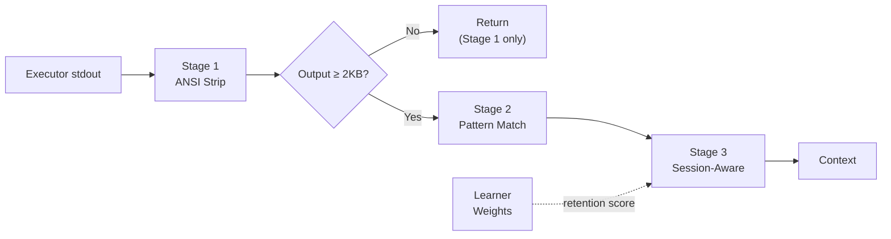
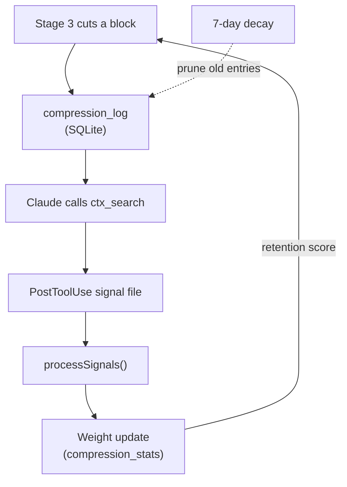

# v1.4.0 Documentation Update — Implementation Plan

> **For agentic workers:** REQUIRED SUB-SKILL: Use superpowers:subagent-driven-development (recommended) or superpowers:executing-plans to implement this plan task-by-task. Steps use checkbox (`- [ ]`) syntax for tracking.

**Goal:** Update USER-MANUAL.md and README-FULL.md/PDF to cover v1.3.0 compression pipeline, self-learning, expanded routing, and v1.3.1 bug fixes.

**Architecture:** Docs-only change. Two files modified: `USER-MANUAL.md` (root) and `docs/README-FULL.md`. PDF regenerated from README-FULL.md via `npx md-to-pdf`. No code changes, no version bump.

**Tech Stack:** Markdown, Mermaid (rendered as code blocks in md-to-pdf), md-to-pdf for PDF generation.

---

### Task 1: USER-MANUAL.md — Token Compression Section

**Files:**
- Modify: `USER-MANUAL.md:14-18` (insert after "Session Memory" bullet in "The Solution" section)

- [ ] **Step 1: Add compression to "The Solution" list**

After the existing three bullets (Sandbox Execution, Knowledge Base, Session Memory), add a fourth:

```markdown
4. **Token Compression** — When tool output does come back, Context Mode automatically shrinks it before it enters the conversation. Passing tests get collapsed to a summary. Install progress bars disappear. Only errors and warnings are kept word-for-word.
```

- [ ] **Step 2: Add new "Token Compression" section**

Insert a new section after "### What Happens When Context Gets Full (Session Compaction)" (line ~157) and before "## Updating Context Mode" (line ~177). Add:

```markdown
### Token Compression — Automatic Output Shrinking

Starting in version 1.3.0, Context Mode automatically compresses tool output before it enters the conversation. You don't need to do anything — this happens in the background every time Claude runs a command through the sandbox.

**What gets compressed:**

- **Test results** — When Claude runs your tests, passing tests are collapsed into a count ("42 tests passed"). Failing tests are kept exactly as they are, word for word, so Claude can diagnose the problem.
- **Install logs** — When packages are installed (npm, pip), progress bars and download status are stripped. Warnings and errors are preserved.
- **Build output** — Compiler output from tools like `cargo build`, `docker build`, and `make` gets condensed. Compile errors and warnings are kept intact.
- **Git logs and diffs** — Long commit histories and large diffs are condensed while keeping the structure readable.
- **Directory listings** — Large folder listings are trimmed to the most relevant entries.

**What is never compressed:**

Errors and warnings are sacred. If a line contains words like "error," "warning," "fail," "panic," "exception," or "traceback," that line — plus the two lines above and below it — are always preserved exactly as they appeared. Context Mode will never hide a problem from Claude.

**Small outputs are left alone:**

If the output is under 2KB (roughly 40 lines of text), Context Mode only strips invisible terminal formatting codes. It doesn't try to compress small outputs because the savings wouldn't be worth the risk of losing useful detail.

**How much does it save?**

In a typical session with test runs, installs, and builds, compression reduces token usage by 40–90% on top of the savings from sandboxing. You can see exact numbers by running `/ctx-stats`.
```

- [ ] **Step 3: Verify the edit reads correctly**

Re-read USER-MANUAL.md to confirm the new section flows naturally between the compaction section and the updating section.

---

### Task 2: USER-MANUAL.md — Reading ctx_stats

**Files:**
- Modify: `USER-MANUAL.md:113-119` (replace existing `/ctx-stats` section)

- [ ] **Step 1: Replace the ctx_stats slash command section**

Replace the existing `/ctx-stats` content (lines ~113–119) with an expanded walkthrough:

```markdown
#### `/ctx-stats` — See Your Savings
Run this any time to see how much context space Context Mode has saved. Here's what the output looks like:

```
# Token Savings This Session (45m)

  Compressed:    12,400 → 3,100 tokens (75.0% reduction)
  Sandboxed:     38,800 tokens kept out of context
  KB retrievals: 12 searches
  ─────────────────────────────────
  Total saved:   48,100 tokens
  Est. cost saved: $0.72 (Opus) / $0.14 (Sonnet) / $0.04 (Haiku)

## Top Compressed Outputs
  npm_test (x3): 4.2K → 0.8K (81.0%)
  git_log (x2): 3.1K → 1.2K (61.3%)
  pip_install (x1): 2.8K → 0.4K (85.7%)

## Learner
  Patterns tracked:  47 decisions
  Retrieval rate:    8/47 (17.0%)
  Confidence:        High
```

**What each line means:**

- **Compressed** — How many tokens went through the compression pipeline and how much smaller they got. "12,400 → 3,100" means the compressor saw 12,400 tokens of output and reduced it to 3,100.
- **Sandboxed** — Tokens that never entered the conversation at all because they were processed in the sandbox and only the result came back.
- **KB retrievals** — How many times Claude searched the knowledge base instead of re-reading raw content.
- **Total saved** — Compression savings plus sandboxed tokens combined.
- **Est. cost saved** — What those saved tokens would have cost at current pricing for each model tier.
- **Top Compressed Outputs** — Which types of tool output were compressed the most. The format is: `pattern (times seen): before → after (reduction%)`.
- **Learner** — The self-learning system tracks how often compressed content gets retrieved later. A high retrieval rate means the compressor is being too aggressive; it adjusts automatically over time. "High" confidence means enough data has been collected for the weights to be meaningful.

**How to use it:** Type `/ctx-stats` in the Claude Code input and press Enter.
```

- [ ] **Step 2: Verify formatting**

Re-read the modified section to confirm the nested code block renders correctly.

---

### Task 3: USER-MANUAL.md — Updated Routing Section

**Files:**
- Modify: `USER-MANUAL.md:67-91` (Tool Steering section)

- [ ] **Step 1: Update the tool steering table**

After the existing table (line ~78), add a new subsection:

```markdown
#### Auto-Redirected Commands (New in v1.3.0)

Some commands produce so much output that they're automatically redirected through the compression pipeline. These commands are intercepted before they run and rerouted through Context Mode's sandbox, where their output is compressed before it enters the conversation:

| Command | What Happens |
|---------|-------------|
| `git log` (unbounded) | Redirected — but `git log --oneline` or `git log -n 5` pass through normally |
| `git diff` (unbounded) | Redirected — but `git diff --stat` or piped through `grep` passes through |
| `npm test` / `jest` / `vitest` | Redirected — test output compressed (passes collapsed, failures preserved) |
| `pytest` | Redirected — same compression as npm test |
| `npm install` / `npm ci` | Redirected — progress bars stripped, warnings preserved |
| `pip install` | Redirected — download progress stripped, warnings preserved |
| `cargo build` / `cargo test` | Redirected — compile steps collapsed, errors preserved |
| `docker build` | Redirected — cache lines collapsed, step output and errors preserved |
| `make` / `cmake --build` | Redirected — similar to cargo, compile noise reduced |

**When commands pass through normally:** If you pipe output through another command (like `git log | grep fix`), limit results (like `git log -n 5`), or use compact flags (like `git diff --stat`), the command runs normally without redirection. Context Mode only intercepts commands that would produce large, unbounded output.
```

- [ ] **Step 2: Verify the new table reads correctly**

Re-read the Tool Steering section to confirm the new subsection flows naturally after the existing table.

---

### Task 4: USER-MANUAL.md — New Error Messages + Troubleshooting

**Files:**
- Modify: `USER-MANUAL.md:212-219` (troubleshooting section, after "Context is still growing fast")

- [ ] **Step 1: Add fetch error troubleshooting entry**

After the existing "Context is still growing fast" troubleshooting entry, add:

```markdown
### "Fetch failed: no content returned"
This means Context Mode tried to download a web page but got nothing back. The URL might be wrong, the site might be down, or it might be blocking automated requests.

**Fix:** Check that the URL is correct and accessible in a browser. If the site requires authentication or blocks bots, the content can't be fetched automatically — try copying the content manually and using `ctx_index` to store it.
```

- [ ] **Step 2: Verify the edit**

Re-read the troubleshooting section to confirm the new entry follows the established pattern.

---

### Task 5: USER-MANUAL.md — "How It Works" Technical Appendix

**Files:**
- Modify: `USER-MANUAL.md` (insert before Glossary section)

- [ ] **Step 1: Add the technical appendix**

Insert the following before the "## Glossary" section (line ~222):

```markdown
---

## How It Works — Technical Appendix

This section is for technically curious users who want to understand what's happening under the hood. You don't need to read this to use Context Mode — everything described here happens automatically.

### The 3-Stage Compression Pipeline

Every piece of tool output that exceeds 2KB goes through three compression stages:

**Stage 1 — Deterministic Stripping (Lossless)**
Removes invisible noise that adds no value: ANSI color codes (the escape sequences that make terminal output colorful), carriage return overwrites (used by progress bars), UTF-8 byte order marks, trailing whitespace, and duplicate blank lines. This stage always runs, even on small outputs, because it's cheap and never loses meaningful content.

**Stage 2 — Pattern-Based Compression**
Recognizes 10 specific types of tool output and applies tailored compression rules to each:

| Pattern | What It Does |
|---------|-------------|
| npm test (jest/vitest) | Collapses passing test suites to a count; preserves failing tests verbatim |
| pytest | Same approach — passes collapsed, failures preserved |
| git log | Condenses commit entries while keeping structure |
| git diff | Reduces hunks while preserving changed lines |
| npm install | Strips progress bars and download indicators |
| pip install | Strips download progress and cache messages |
| cargo build | Collapses compile steps, preserves errors and warnings |
| docker build | Collapses cache lines and layer steps |
| make/cmake | Reduces compile noise, preserves errors |
| directory listing | Trims large listings to most relevant entries |

If the output doesn't match any known pattern, this stage is skipped entirely.

**Stage 3 — Session-Aware Relevance (Lossy)**
Splits the output into blocks and scores each one for relevance to the current session. Blocks that mention files you've been working on score higher. Blocks containing error keywords are always preserved. Low-relevance blocks are cut and replaced with a note like "42 lines in 3 blocks summarized (indexed, use ctx_search to query)." The cut content is still in the knowledge base — Claude can search for it if needed later.

### Error Safety Invariant

The compression pipeline enforces one absolute rule: **lines containing error-related keywords are never compressed.** The protected keywords are:

`error`, `Error`, `ERROR`, `fail`, `FAIL`, `warning`, `Warning`, `WARN`, `panic`, `exception`, `traceback`, `TypeError`, `ReferenceError`, `SyntaxError`, `ENOENT`, `EPERM`, `EACCES`

When one of these keywords appears on a line, that line and the two lines above and below it are marked as protected. No compression stage will touch them. This means Claude always sees the full context of any error, even in heavily compressed output.

### Self-Learning Feedback Loop

Context Mode tracks its own compression decisions and learns from them:

1. **Compression decision** — When Stage 3 cuts a block, it logs the decision with a content hash
2. **Retrieval signal** — If Claude later searches for that content (via `ctx_search`), a signal file is written noting the retrieval
3. **Weight adjustment** — Periodically, the learner reads these signals and adjusts retention weights per tool pattern. If compressed content gets retrieved often, the weight increases (meaning future output from that tool will be compressed less aggressively). If compressed content is rarely retrieved, the weight stays low or decreases.
4. **Decay** — Signals older than 7 days are pruned so the learner adapts to changing work patterns

The learner's weights are cached for 5 minutes and stored in a SQLite database alongside the knowledge base.

### The 2KB Threshold

Outputs smaller than 2,048 bytes only get Stage 1 processing (ANSI stripping). The reasoning: small outputs don't consume much context, and aggressive compression on a 30-line output risks losing detail that matters. The 2KB threshold is where the cost-benefit tips toward compression.
```

- [ ] **Step 2: Verify the appendix reads correctly**

Re-read the inserted section to confirm it flows before the Glossary.

---

### Task 6: USER-MANUAL.md — Glossary Updates

**Files:**
- Modify: `USER-MANUAL.md` (Glossary section, currently line ~222)

- [ ] **Step 1: Add new glossary terms**

Add these entries to the existing Glossary, maintaining alphabetical order:

```markdown
- **Compression** — The process of shrinking tool output before it enters the conversation. Context Mode uses a 3-stage pipeline: stripping invisible formatting, applying pattern-specific rules, and filtering by session relevance.
- **Context Window** — The conversation memory Claude uses. It has a limited size. When it fills up, older parts get compressed.
- **Pipeline** — A series of processing steps that data passes through in order. Context Mode's compression pipeline has three stages.
- **Retention Score** — A number that controls how aggressively the compressor filters content for a given tool pattern. Higher scores mean more content is kept. The self-learning system adjusts these automatically.
- **Retrieval Rate** — The percentage of compressed content that Claude later searches for. A high retrieval rate means the compressor was cutting things Claude actually needed.
- **Token** — The smallest unit of text that Claude processes. Roughly 4 characters or 3/4 of a word. Context windows are measured in tokens.
```

- [ ] **Step 2: Verify alphabetical order**

Re-read the Glossary to confirm all entries (existing + new) are in alphabetical order. Move entries if needed.

- [ ] **Step 3: Commit USER-MANUAL.md changes**

```bash
cd "C:/Users/scott/AppData/Local/Temp/context-mode-release"
git add USER-MANUAL.md
git commit -m "docs: update USER-MANUAL.md for v1.3.0 compression, learner, routing

Add Token Compression section, expanded ctx_stats walkthrough, auto-redirected
commands table, fetch error troubleshooting, How It Works technical appendix,
and 6 new glossary terms."
```

---

### Task 7: README-FULL.md — Compression Pipeline Architecture Diagram

**Files:**
- Modify: `docs/README-FULL.md:62-93` (after the existing Data Flow diagram)

- [ ] **Step 1: Add compression pipeline diagram**

After the existing Data Flow diagram (Figure 2, around line 142), insert:

````markdown
### Compression Pipeline


<div class="caption">Figure 3: Compression Pipeline — 3-stage output compression between executor and context return</div>
````

- [ ] **Step 2: Add learner feedback loop diagram**

Immediately after the compression pipeline diagram, add:

````markdown
### Learner Feedback Loop


<div class="caption">Figure 4: Learner Feedback Loop — compression decisions feed retrieval signals back to retention weights</div>
````

- [ ] **Step 3: Verify both diagrams are valid Mermaid**

Re-read the inserted section to confirm syntax correctness.

---

### Task 8: README-FULL.md — Updated System Architecture + Hook Counts

**Files:**
- Modify: `docs/README-FULL.md`

- [ ] **Step 1: Update directory structure**

In the directory structure (around line 147), add the new files under `server/`:

```
│   ├── compressor.js         # 3-stage compression pipeline (10 pattern matchers)
│   ├── learner.js            # Self-learning retention weights (SQLite, 7-day window)
```

- [ ] **Step 2: Update hooks.json comment**

Change line 170:
```
├── hooks/
│   ├── hooks.json            # 6 hook events, 14 matchers (9 PreToolUse)
```
to:
```
├── hooks/
│   ├── hooks.json            # 6 hook events, 23 matchers (9 PreToolUse + 14 routing)
```

- [ ] **Step 3: Update "Hook System" matcher count**

In Section 5 (Hook System), update the text "Total: 6 hook events, 14 matchers." to "Total: 6 hook events, 23 matchers (9 PreToolUse hook matchers + 14 command routing matchers in routing.js)."

- [ ] **Step 4: Update "9 PreToolUse Matchers" heading**

In Section 4 (Tool Steering), change the heading "### 9 PreToolUse Matchers" to "### PreToolUse Matchers" (the count is now contextual — 9 hook-level + 14 command-level routing matchers = 23 total).

- [ ] **Step 5: Add routing matchers table**

After the existing 9 PreToolUse matchers list, add:

```markdown
### Command Routing Matchers (v1.3.0)

Within the Bash PreToolUse handler, 14 additional command-level matchers redirect high-output commands through the compression pipeline:

| Matcher | Pass-Through Conditions |
|---------|------------------------|
| `git log` | `--oneline`, `-n N`, `-N`, piped through `grep`/`head`/`tail` |
| `git diff` | `--stat`, `--name-only`, `--name-status`, piped |
| `npm test` / `jest` / `vitest` | None — always redirected |
| `pytest` / `python -m pytest` | None — always redirected |
| `npm install` / `npm ci` | None — always redirected |
| `pip install` | None — always redirected |
| `cargo build` | None — always redirected |
| `cargo test` | None — always redirected |
| `docker build` | None — always redirected |
| `make` | None — always redirected |
| `cmake --build` | None — always redirected |

Commands with pass-through conditions are only redirected when the output would be unbounded. Adding flags that limit output (like `git log -n 5`) or piping through filters (like `| grep`) causes the command to pass through normally.
```

- [ ] **Step 6: Verify the edits**

Re-read Section 4 and Section 5 to confirm consistency.

---

### Task 9: README-FULL.md — New Compression & Learner Sections

**Files:**
- Modify: `docs/README-FULL.md` (insert after Section 14, before Section 15)

- [ ] **Step 1: Add Section 15 — Compression Pipeline**

Insert a new section after the Search Algorithm section:

```markdown
## 15. Compression Pipeline

Added in v1.3.0. The compression pipeline processes tool output through three stages before it enters the context window.

### Architecture

The pipeline is implemented in `server/compressor.js` (689 lines). It exports three stage functions and a `compress()` entry point.

### Stage 1 — Deterministic Stripping

Always runs. Removes:
- ANSI escape codes (`\x1b[...m` sequences)
- Carriage return overwrites (progress bar rewrites)
- UTF-8 BOM markers
- Trailing whitespace per line
- Duplicate blank lines (collapsed to single)

### Stage 2 — Pattern-Based Compression

Runs when output ≥ 2,048 bytes. Detects tool type from the command string and applies one of 10 pattern matchers:

| Matcher | Detection | Compression Strategy |
|---------|-----------|---------------------|
| `npm_test` | `npm test`, `npx jest`, `npx vitest` | Collapse passing suites to count; preserve failures verbatim |
| `npm_install` | `npm install`, `npm ci` | Strip progress bars, preserve warnings/errors |
| `git_log` | `git log` | Condense commit entries |
| `git_diff` | `git diff` | Reduce hunks, preserve changed lines |
| `pip_install` | `pip install` | Strip download progress |
| `pytest` | `pytest`, `python -m pytest` | Collapse passes, preserve failures |
| `cargo_build` | `cargo build`, `cargo test` | Collapse compile steps |
| `docker_build` | `docker build` | Collapse cache/layer lines |
| `make` | `make`, `cmake --build` | Reduce compile noise |
| `directory_listing` | `ls`, `find`, `tree` | Trim to relevant entries |

### Stage 3 — Session-Aware Relevance

Runs when output ≥ 2,048 bytes. Splits output into blank-line-separated blocks and scores each:

- **File relevance** (+0.8): block mentions a file from the current session's file operations
- **Code file reference** (+0.2): block mentions any source file pattern (`.js`, `.py`, `.rs`, etc.)
- **Error protection** (1.0): block contains an error-tagged line

Blocks scoring above the relevance threshold (adjusted by learner retention score) are preserved. Below-threshold blocks are cut and replaced with a summary line. Cut content remains in the knowledge base.

### Error Safety Invariant

The regex `/\b(error|Error|ERROR|fail|FAIL|warning|Warning|WARN|panic|exception|traceback|TypeError|ReferenceError|SyntaxError|ENOENT|EPERM|EACCES)\b/` tags lines as protected. Protected lines and their 2-line context (above and below) are never compressed by any stage.

### Constants

| Constant | Value | Purpose |
|----------|-------|---------|
| `COMPRESSION_THRESHOLD_BYTES` | 2,048 | Below this, only Stage 1 runs |
| `RELEVANCE_THRESHOLD` | 0.4 | Minimum score for block preservation |
| `DEFAULT_RETENTION` | 0.5 | Learner weight when no data exists |
```

- [ ] **Step 2: Add Section 16 — Self-Learning Compression**

```markdown
## 16. Self-Learning Compression

Added in v1.3.0. The learner (`server/learner.js`) tracks compression decisions and adjusts retention weights based on retrieval patterns.

### Schema

```sql
-- Tracks every Stage 3 cut decision
CREATE TABLE compression_log (
  id INTEGER PRIMARY KEY AUTOINCREMENT,
  session_id TEXT,
  tool_pattern TEXT,
  content_hash TEXT,
  content_preview TEXT,
  was_retrieved INTEGER DEFAULT 0,
  created_at TEXT DEFAULT (datetime('now'))
);

-- Aggregated per-pattern weights
CREATE TABLE compression_stats (
  tool_pattern TEXT PRIMARY KEY,
  total_compressed INTEGER DEFAULT 0,
  total_retrieved INTEGER DEFAULT 0,
  retention_weight REAL DEFAULT 0.5,
  updated_at TEXT DEFAULT (datetime('now'))
);
```

### Feedback Loop

1. **Log**: When `compress()` runs Stage 3 and cuts blocks, each decision is logged with a content hash and preview
2. **Signal**: PostToolUse hook detects `ctx_search` calls and writes signal files to the plugin data directory
3. **Process**: `processSignals()` reads signal files, matches content hashes against `compression_log`, and marks matches as `was_retrieved = 1`
4. **Update**: Per-pattern stats are recalculated — `retention_weight` increases when retrieval rate is high, decreases when low
5. **Apply**: Next `compress()` call reads the updated retention weight and uses it in Stage 3 scoring

### Lifecycle

- **SessionStart**: Prunes `compression_log` and `compression_stats` entries older than 7 days
- **Weight cache**: Retention weights are cached in memory for 5 minutes to avoid repeated SQLite reads
- **Stats flush**: Compression statistics are flushed to SQLite every 5 minutes and on shutdown

### Learner in ctx_stats

The `ctx_stats` output includes a Learner section:
- **Patterns tracked**: total compression decisions logged
- **Retrieval rate**: how many compressed items were later retrieved via ctx_search
- **Confidence**: "High" when retrieval count / decision count > 0.1, "Learning" otherwise
```

- [ ] **Step 3: Renumber subsequent sections**

The old sections 15–19 become 17–21. Update the Table of Contents accordingly.

- [ ] **Step 4: Verify section numbering is consistent**

Re-read the Table of Contents and all section headers to confirm numbers match.

---

### Task 10: README-FULL.md — Tool Reference + Specs Updates

**Files:**
- Modify: `docs/README-FULL.md`

- [ ] **Step 1: Update ctx_stats row in MCP tools table**

In the MCP Server & Tools table (Section 10), update the ctx_stats row:

Old: `| ctx_stats | (none) | session report | N/A |`
New: `| ctx_stats | (none) | token savings, cost estimates, compression breakdown, learner metrics | N/A |`

- [ ] **Step 2: Add compression note to ctx_execute row**

Add a note after the MCP tools table:

```markdown
> **v1.3.0**: `ctx_execute`, `ctx_batch_execute`, and `ctx_execute_file` now compress output through the 3-stage pipeline before returning to context. Error output is never compressed.
```

- [ ] **Step 3: Add ctx_fetch_and_index error note**

After the auto-indexing behavior section, add:

```markdown
> **v1.3.1**: `ctx_fetch_and_index` now returns an explicit error message ("Fetch failed: no content returned from {url}") when a URL fetch produces no output, instead of silently indexing empty content.
```

- [ ] **Step 4: Update Testing section**

In the Testing section (now Section 21), update the test count:

Old: "covering 216 tests across 19 sections"
New: "covering 355 tests across 19 sections (216 E2E + 62 adversarial + 32 compressor + 13 learner + 31 routing + 1 fetch error)"

- [ ] **Step 5: Update the version header**

Change line 33: `**Version 1.2.1** | Elastic License 2.0 | April 2026`
To: `**Version 1.3.1** | Elastic License 2.0 | April 2026`

- [ ] **Step 6: Update the Overview section**

In Section 1 (Overview), the five mechanisms list needs a sixth bullet:

```markdown
- **Token Compression**: A 3-stage pipeline compresses tool output before it returns to context — deterministic stripping, pattern-based compression (10 tool-specific matchers), and session-aware relevance filtering guided by a self-learning retention model.
```

- [ ] **Step 7: Commit README-FULL.md changes**

```bash
cd "C:/Users/scott/AppData/Local/Temp/context-mode-release"
git add docs/README-FULL.md
git commit -m "docs: update README-FULL.md for v1.3.0 compression, learner, expanded routing

Add compression pipeline + learner feedback loop diagrams, new Sections 15-16,
command routing matchers table, updated tool references, test count 355,
version header to 1.3.1."
```

---

### Task 11: Regenerate PDF

**Files:**
- Modify: `docs/README-FULL.pdf` (generated)

- [ ] **Step 1: Install md-to-pdf if not present**

```bash
cd "C:/Users/scott/AppData/Local/Temp/context-mode-release"
cmd="install" && npm $cmd --save-dev md-to-pdf 2>&1
```

- [ ] **Step 2: Generate PDF**

```bash
cd "C:/Users/scott/AppData/Local/Temp/context-mode-release"
npx md-to-pdf docs/README-FULL.md 2>&1
```

- [ ] **Step 3: Verify PDF was created**

```bash
ls -la "C:/Users/scott/AppData/Local/Temp/context-mode-release/docs/README-FULL.pdf"
```

- [ ] **Step 4: Commit the PDF**

```bash
cd "C:/Users/scott/AppData/Local/Temp/context-mode-release"
git add docs/README-FULL.pdf
git commit -m "docs: regenerate README-FULL.pdf from updated markdown"
```

---

### Task 12: Final Verification

- [ ] **Step 1: Re-read USER-MANUAL.md in full**

Read the entire file top to bottom. Check for:
- Consistent tone (warm, patient, no jargon without definition)
- Logical flow between sections
- No broken markdown (unclosed code blocks, mismatched headers)
- Glossary entries in alphabetical order

- [ ] **Step 2: Re-read docs/README-FULL.md in full**

Read the entire file. Check for:
- Table of Contents matches actual section numbers
- Mermaid diagrams have valid syntax
- No dangling references to old section numbers
- Version header says 1.3.1
- Test count says 355

- [ ] **Step 3: Run tests to confirm no regressions**

```bash
cd "C:/Users/scott/AppData/Local/Temp/context-mode-release"
node test-e2e.js 2>&1
```

- [ ] **Step 4: Run verify-release.sh**

```bash
cd "C:/Users/scott/AppData/Local/Temp/context-mode-release"
bash scripts/verify-release.sh 2>&1
```
